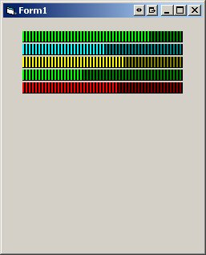



## Led Meter, Progressbar

### Description

A Led Meter for VU-fx. This control can also be used for a nicer progressbar. You can set the value by code or click on the control to give a value for volume control or slider.
 
### More Info
 

             |
---                |---
**Submitted On**   |2006-08-22 10:50:02
**By**             |[FJ Botha](https://github.com/Planet-Source-Code/PSCIndex/blob/master/ByAuthor/fj-botha.md)
**Level**          |Advanced
**User Rating**    |4.8 (19 globes from 4 users)
**Compatibility**  |VB 6\.0
**Category**       |[Custom Controls/ Forms/  Menus](https://github.com/Planet-Source-Code/PSCIndex/blob/master/ByCategory/custom-controls-forms-menus__1-4.md)
**World**          |[Visual Basic](https://github.com/Planet-Source-Code/PSCIndex/blob/master/ByWorld/visual-basic.md)
**Archive File**   |[Led\_Meter\_2015138222006\.zip](https://github.com/Planet-Source-Code/fj-botha-led-meter-progressbar__1-66341/archive/master.zip)

